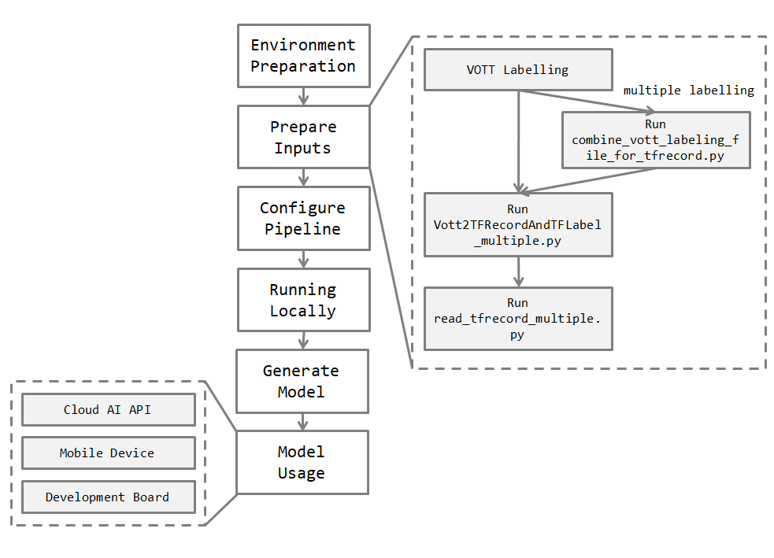
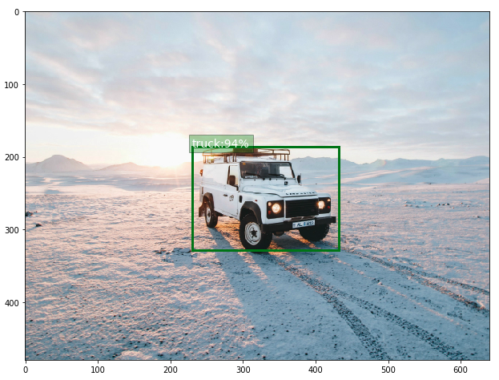

# Tensorflow Object Detection Flow


The tutorial is the workflow from labeling objects (using vott), building a object detection model in tensorflow, training it locally, and then embedding it on cloud API server or mobile device.


The flowchart is like below.




Reference

* Vott labeling tool: https://github.com/jiankaiwang/vott

* object detection: https://github.com/tensorflow/models/tree/master/research/object_detection
* cloud api server (light): https://github.com/jiankaiwang/scai
* mobile device
* development board


## Model Generation


### Environment Preparation

Follow the webpage (https://github.com/tensorflow/models/blob/master/research/object_detection/g3doc/installation.md) to install necessary packages or setup environment variables.

Second, git clone the necessary repositories, including `tensorflow/tensorflow`, `tensorflow/models`, and `jiankaiwang/TF_ObjectDetection_Flow` from github.com.

```shell
cd ~
git clone https://github.com/tensorflow/tensorflow.git
git clone https://github.com/tensorflow/models.git
git clone https://github.com/jiankaiwang/TF_ObjectDetection_Flow.git
```


### Prepare inputs

In TF_ObjectDetection_Flow, the directionary `raw/origindata` conserves the example dataset which consists of 5 types of flowers. The dataset is downloaded from tensorflow.org (https://www.tensorflow.org/tutorials/image_retraining) and it is good resource for the image classification task and the object detection task. 

Then we use tool vott (https://github.com/jiankaiwang/vott) to label the flower dataset and further use the labeling data to train the model.

The default directory is like the below structure. After labeling one type of images, vott would output a single labelling data (default is the folder name with json extension, for example, sunflowers with sunflowers.json). We can put all of them into one directory as below.

```text
+ raw
  + origindata
    + daisy
    + dandelion
    + roses
    + sunflowers
    + tulips
    - daisy.json
    - dandelion.json
    - roses.json
    - sunflowers.json
    - tulips.json
```

[**Optional**] If you have multiple labelling data, the script `combine_vott_labeling_file_for_tfrecord.py` is to help you combine multiple labelling data. The default directory is like below.

```text
+ tmp
  + input
  - label1.json
  - label2.json
  - label3.jons
```

**The script would combine all of json files with no regrading their name**. The folder `input` conserves all image files which are already labelled. The following is the command running the script.

```shell
cd ~/TF_ObjectDetection_Flow 
python combine_vott_labeling_file_for_tfrecord.py \
	--labeldir=./tmp
	--labelImgdir=./tmp/input
	--outputdir=./tmp
	--outputImgdir=./tmp/output
	--compressedwidth=64
	--compressedheight=auto
```

The script `Vott2TFRecordAndTFLabel_multiple.py` is to transform vott labeling data into `tfrecords` format. You can also read tfrecords data by running the script `read_tfrecord_multiple.py`. 

```shell
cd ~/TF_ObjectDetection_Flow 
python Vott2TFRecordAndTFLabel_multiple.py \
	--labeldir=./raw/origindata \
	--outputfilepath=./data \
	--trainevalratio=0.8
```

Reference: [PASCAL VOC/ Oxford-IIIT Pet](https://github.com/tensorflow/models/blob/master/research/object_detection/g3doc/preparing_inputs.md), [Your-Own Dataset](https://github.com/tensorflow/models/blob/master/research/object_detection/g3doc/using_your_own_dataset.md)


### Configure an object detection training pipeline

The basic object detection training model configurate is like the below.

```ini
model {
(... Add model config here...)
}

train_config : {
(... Add train_config here...)
}

train_input_reader: {
(... Add train_input configuration here...)
}

eval_config: {
}

eval_input_reader: {
(... Add eval_input configuration here...)
}
```


You can copy the sample configuration file from path `models/research/object_detection/samples/configs ` to quickly establish your own configuration. 

Here, we uesd the model, `ssd_mobilenet_v1_coco.config`, as the example.

```shell
# make sure to git clone https://github.com/tensorflow/models.git
cd ~/models/research
mkdir ./TF_ObjectDetection_Flow
cp object_detection/samples/config/ssd_mobilenet_v1_coco.config ./TF_ObjectDetection_Flow

# change parameters to your own settings
vim ./TF_ObjectDetection_Flow/ssd_mobilenet_v1_coco.config
```

Be aware of changing **num_classes** in the configuration file, and make sure to edit sections with **"PATH_TO_BE_CONFIGURED"** tag.


```ini
model {
  ssd {
    num_classes: (change to your dataset)
    # ...
    # as the default
    # ...
  }
}

train_config: {
  # ...
  # as the default
  # ...
  fine_tune_checkpoint: "(you can keep this empty if there is no fine tune model)"
  from_detection_checkpoint: true
  # Note: The below line limits the training process to 200K steps, which we
  # empirically found to be sufficient enough to train the pets dataset. This
  # effectively bypasses the learning rate schedule (the learning rate will
  # never decay). Remove the below line to train indefinitely.
  num_steps: (you can change to fit your dataset)
  data_augmentation_options {
    random_horizontal_flip {
    }
  }
  data_augmentation_options {
    ssd_random_crop {
    }
  }
}

train_input_reader: {
  tf_record_input_reader {
    # PATH_TO_BE_CONFIGURED
    input_path: "TF_ObjectDetection_Flow/data/train.tfrecords"
  }
  # PATH_TO_BE_CONFIGURED
  label_map_path: "TF_ObjectDetection_Flow/data/image_label.pbtxt"
}

eval_config: {
	# as the default
}

eval_input_reader: {
  tf_record_input_reader {
    # PATH_TO_BE_CONFIGURED
    input_path: "TF_ObjectDetection_Flow/data/eval.tfrecords"
  }
  # PATH_TO_BE_CONFIGURED
  label_map_path: "TF_ObjectDetection_Flow/data/image_label.pbtxt"
  shuffle: false
  num_readers: 1
}

```


Reference: https://github.com/tensorflow/models/blob/master/research/object_detection/g3doc/configuring_jobs.md


### Running Locally

The recommanded directionary structure is like the below.

```text
+ raw (see the above "Prepare inputs" section)
+ tmp (see the above "Prepare inputs" section)
+ data (conserve the tfrecord files and label map file)
  - label_map file
  - train TFRecord file
  - eval TFRecord file
+ models
  + model
    - pipeline config file
    + train
    + eval
```


#### Running the Training job

```shell
# From the tensorflow/models/research/ directory
python object_detection/train.py \
    --logtostderr \
    --pipeline_config_path=${PATH_TO_YOUR_PIPELINE_CONFIG} \
    --train_dir=${PATH_TO_TRAIN_DIR}
```

for example,

```shell
cd ~/models/research
python object_detection/train.py \
    --logtostderr \
    --pipeline_config_path=~/TF_ObjectDetection_Flow/models/model/ssd_mobilenet_v1_coco.config \
    --train_dir=~/TF_ObjectDetection_Flow/models/model/train
```

The training result would be conserved under path `~/TF_ObjectDetection_Flow/models/model/train`.


#### Running the Evaluation Job

```shell
# From the tensorflow/models/research/ directory
python object_detection/eval.py \
    --logtostderr \
    --pipeline_config_path=${PATH_TO_YOUR_PIPELINE_CONFIG} \
    --checkpoint_dir=${PATH_TO_TRAIN_DIR} \
    --eval_dir=${PATH_TO_EVAL_DIR}
```

for example,

```shell
cd ~/models/research
python object_detection/eval.py \
	--logtostderr \
	--pipeline_config_path=~/TF_ObjectDetection_Flow/models/model/pipeline.config \
	--checkpoint_dir=~/TF_ObjectDetection_Flow/models/model \
	--eval_dir=~/TF_ObjectDetection_Flow/models/model/eval
```

The evaluated result would be conserved under path `~/TF_ObjectDetection_Flow/models/model/eval`.


Reference: https://github.com/tensorflow/models/blob/master/research/object_detection/g3doc/running_locally.md


### Generate a frozen_inference_graph

You have to replace the **ckpt index**, for example, replace `model.ckpt-120` with your own ckpt index.

```shell
# From tensorflow/models/research/
python object_detection/export_inference_graph.py \
    --input_type image_tensor \
    --pipeline_config_path ${PIPELINE_CONFIG_PATH} \
    --trained_checkpoint_prefix ${TRAIN_PATH} \
    --output_directory output_inference_graph.pb
```

for example,

```shell
cd ~/models/research
python object_detection/export_inference_graph.py \
	--input_type image_tensor \
	--pipeline_config_path ~/TF_ObjectDetection_Flow/models/model/train/pipeline.config \
	--trained_checkpoint_prefix ~/TF_ObjectDetection_Flow/models/model/model.ckpt-120 \
	--output_directory ~/TF_ObjectDetection_Flow/models/model/res
```

The frozen graph would be conserved under path `~/TF_ObjectDetection_Flow/models/model/res`.


Reference: https://github.com/tensorflow/models/blob/master/research/object_detection/g3doc/exporting_models.md


## Model Usage


After you generate a frozen model (`frozen_inference_graph.pb`). You can simply edit and run the notebook https://github.com/tensorflow/models/blob/master/research/object_detection/object_detection_tutorial.ipynb to test and implement the model. 

You can also view the notebook ([ipynb](object_detection_demo.ipynb)) to do inference on an image.




You can also further deploy the model to the cloud-AI API server (https://github.com/jiankaiwang/scai) or to the mobile or to the development board.

 